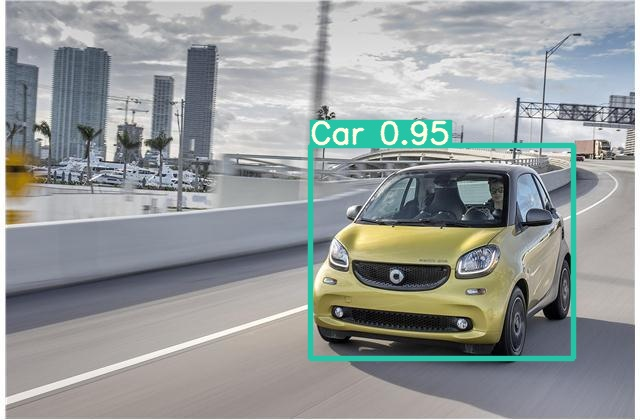
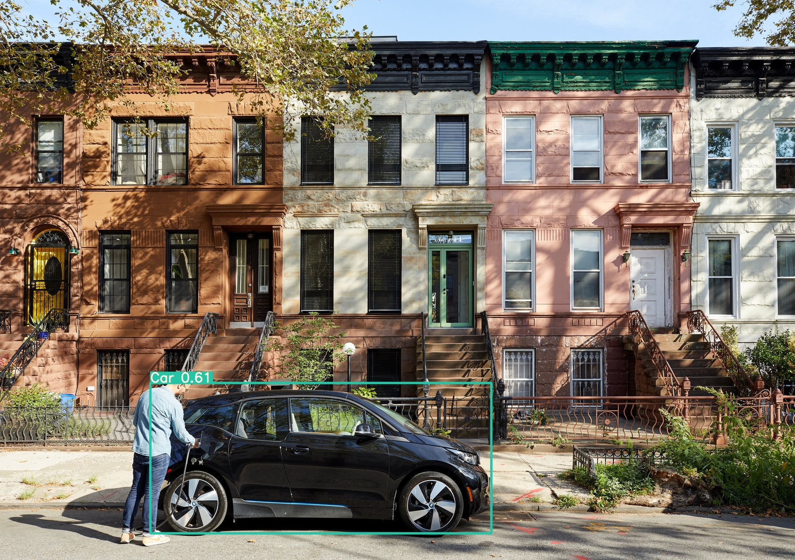

# Car detection
## Prerequisites
1. Clone https://github.com/ultralytics/yolov5 into directory on the same level as current project   
Or change its path in `detect_car.py` before adding to Pythonpath:
```python
cur_path = (Path(os.getcwd()) / __file__).parent
yolov5_path = cur_path.parent / 'yolov5'
```
2. Install requirements:
```pip install -r requirements.txt```

## Running detector
Add files in `images/input` and run
```bash
python detect_car.py
```
Detections will be put in `images/output` directory. Also paths can be set using command line arguments:
```bash
python detect_car.py --input <input-path> --output <output-path>
```

## Examples



